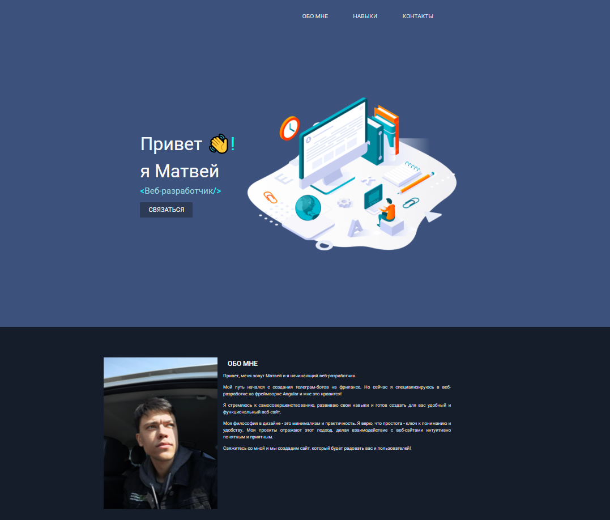
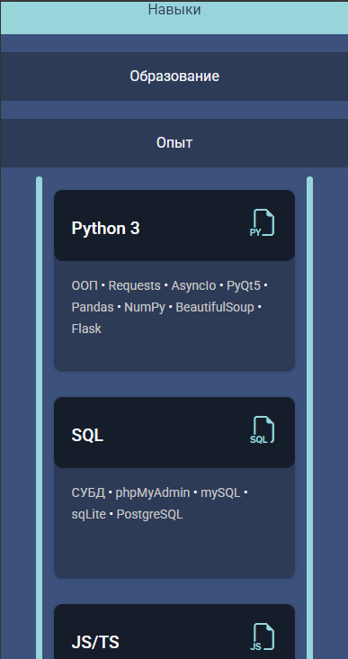
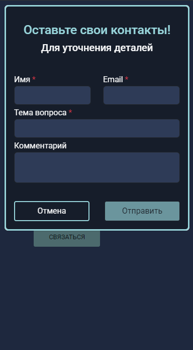

# Фронтенд моего сайта портфолио на Angular 15

## 🚀 Сайт разработчика: [https://mattheweb.ru](https://mattheweb.ru/git-readme-myportfolio)

## Описание ПО
Мой личный сайт-портфолио как веб-разработчика. На сайте представлена моя информация и скиллы.  
Потенциальный работодатель или клиент может оставить свои контакты для связи со мной. После оставленных контактов человеку на email приходит письмо - как и мне - с информацией о вопросе. 
Сайт адаптирован под любые устройства.  

p.s. Сайт морально и технически устарел, в скором времени планируется разработка нового.
### 🛠️ Cтек
    @angular/core": 15.2.0
    @angular/material: 15.2.9
    @auth0/angular-jwt: 5.2.0
    @ng-bootstrap/ng-bootstrap: 14.2.0
    bootstrap: 5.3.2
    bootstrap-icons: 1.11.2
    typescript: 4.9.4
    CSS 3
    HTML 5
    Intellij IDEA v.2024.3
### Цель ПО
Персональный сайт создан для:  
- Практического освоения и самообучения Angular.
- Демонстрации профессиональных навыков в Angular.
- Предоставления информации о моём опыте, образовании и стеке технологий. 
- Упрощения связи со мной для потенциальных работодателей или клиентов.

### Авторизация (В админ панель)
Авторизация происходит через ввод пароля и выдачи JWT-токена (guard angular schematic).  
API запросы доступны только после проверки JWT-токена на его действительность (Токен живет сутки).

### Общий вид ПО

   
    <h4>Главная страница</h4>

   
    <h4>Главная страница | Секция навыков (мобильная версия)</h4>

   
    <h4>Диалоговое окно для связи (мобильная версия)</h4>

## Backend
### 🛠️ Стек
Бекенд написан на Python 3 с помощью Flask фреймворка и библиотек: 
- pymysql
- pymemcache
- jwt
- werkzeug
- smtplib
- email.mime

### БД
- MySQL 8.0  
- phpMyAdmin
## 🔗 Ссылки 

  
  

## Ⓜ️ Skills

## ❗ Важно ❗
Код проекта предоставлен в ознакомительных целях для демонстрации технических навыков разработчика. Проект не будет работать должным образом при самостоятельной сборке ввиду отсутствия доступа к конфиденциальной информации (авторизации).
